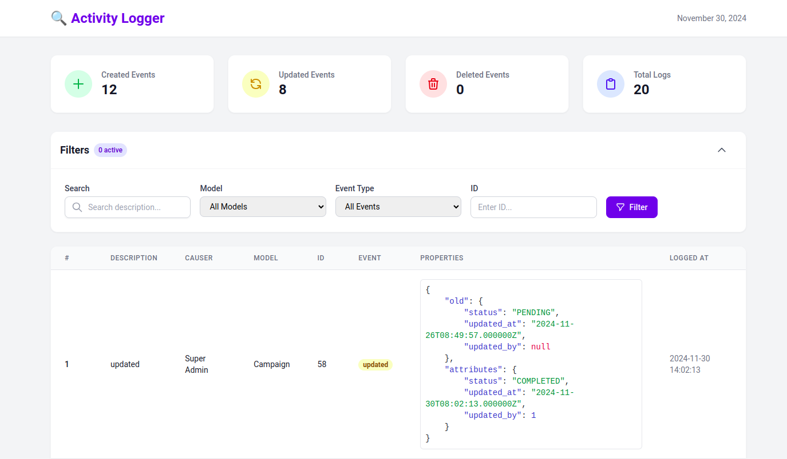

# Laravel Activity Log UI

**Laravel Activity Log UI** is a **Tailwind CSS-powered user interface** for the popular [Spatie Laravel Activitylog](https://spatie.be/docs/laravel-activitylog/v4/introduction) package. It provides an easy-to-use, customizable dashboard to view and manage activity logs in your Laravel application.

[](https://packagist.org/packages/nsd7/laravel-activitylog-ui)
[](LICENSE)
[](https://packagist.org/packages/nsd7/laravel-activitylog-ui)
[](https://www.linkedin.com/in/rh-nowshad)

---

## Features

- Displays activity logs with **search** and **filtering** options.
- Filters by:
  - **Model (subject type)**
  - **Subject ID**
  - **Event type (e.g., created, updated, deleted)**
- Pagination for large activity logs.
- Summary statistics for created, updated, and deleted events.
- **Responsive UI** powered by Tailwind CSS.

---

## Activity Log View



---

## Requirements

- **PHP:** ^8.0
- **Laravel:** ^9.0, ^10.0, or ^11.0
- **spatie/laravel-activitylog:** ^4.0

---

## Installation

1. **Install the Package**

   Add the package to your project using Composer:

   ```bash
   composer require nsd7/laravel-activitylog-ui
   ```

2. **Publish Configurations and Assets**

   Publish the package views for customization (optional):

   ```bash
   php artisan vendor:publish --provider="Nsd7\LaravelActivitylogUi\LaravelActivitylogUiServiceProvider"
   ```

3. **Run Migrations**

   Ensure your database is set up to store activity logs. Follow the [Spatie Laravel Activitylog setup instructions](https://spatie.be/docs/laravel-activitylog/v4/installation).

---

## Usage

Once installed, visit the **Activity Log Dashboard** at the following route:

```plaintext
http://your-app.test/admin/activity-log
```

You can filter logs by:
- **Description** (partial text match)
- **Model Name** (subject type)
- **Subject ID**
- **Event Type** (e.g., created, updated, deleted)

---

## Configuration

### Customizing the Views

If you want to customize the UI:
1. Publish the views:
   ```bash
   php artisan vendor:publish --provider="Nsd7\LaravelActivitylogUi\LaravelActivitylogUiServiceProvider"
   ```
2. Modify the views located in the `resources/views/vendor/activitylog-ui/` directory.

### Tailwind CSS

The package is styled with Tailwind CSS. Ensure your Laravel app has Tailwind configured. Refer to the [Tailwind CSS installation guide](https://tailwindcss.com/docs/installation) if needed.

---

## Getting Started

After installation, visit the dashboard at `/admin/activity-log` to view your activity logs. Use the search and filter options to quickly find specific logs.

---

## License

This package is open-sourced software licensed under the [MIT license](LICENSE).